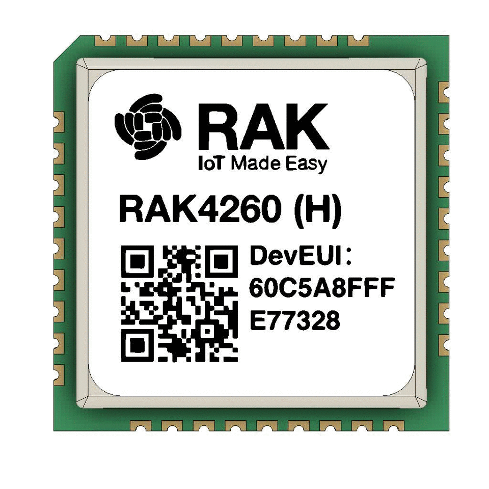

# RAK4260

[RAK4260][1] LoRaWAN module from RAKwireless.

## Download File

* <a rel="eagle" href="https://github.com/ricaun/RAK4260/raw/master/file/RAK4260.lbr" download target="_blank">Eagle Libray</a>
* <a rel="fusion" href="https://a360.co/2rBIWIx">Fusion 360</a>
* <a rel="step" href="https://github.com/ricaun/RAK4260/raw/master/file/RAK4260.step" download target="_blank">Step</a>

----
 

 This work is licensed under a <a rel="license" href="https://creativecommons.org/licenses/by-sa/4.0/">Creative Commons Attribution-ShareAlike 4.0 International License</a>.

[1]: https://doc.rakwireless.com/datasheet/rakproducts/rak4260-wisduo-lora-module-datasheet
